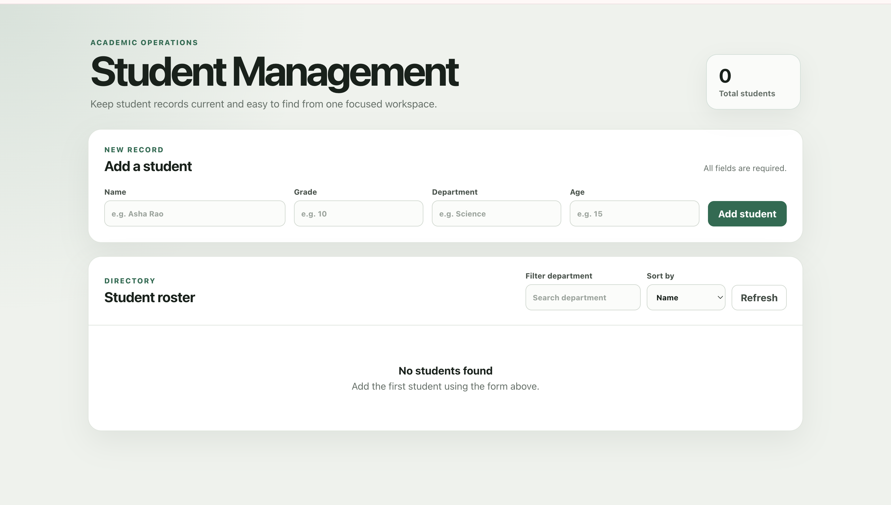

# Student Management System

A Student Management System built using web technologies to efficiently manage student records, academic information, and administrative tasks. The system provides a centralized platform for organizing and maintaining student data in a structured and user-friendly manner.

## Live Demo

Add your Vercel deployment link here:

https://student-management-alpha-flax.vercel.app/

## Features

- Add new student records
- View student details
- Update student information
- Delete student records
- Search and manage students
- Responsive user interface
- Easy-to-use dashboard
- Organized data management

Student Management Systems are commonly used to manage student records, attendance, grades, and academic information in educational institutions. :contentReference[oaicite:0]{index=0}

## Technologies Used

- HTML5
- CSS3
- JavaScript

## Preview



## Project Structure

```text
student-management/
├── index.html
├── style.css
├── script.js
├── assets/
├── screenshots/
│   └── student-management-preview.png
└── README.md
```


## Project Objectives

- Simplify student data management
- Reduce manual record keeping
- Improve data accessibility
- Provide a structured dashboard interface
- Enhance frontend development skills

## Learning Outcomes

Through this project, I learned:

- CRUD Operations
- DOM Manipulation
- Data Handling
- Responsive Web Design
- User Interface Design
- Frontend Project Architecture

## Future Enhancements

- Database Integration
- User Authentication
- Attendance Tracking
- Grade Management
- Report Generation
- Export Student Records

